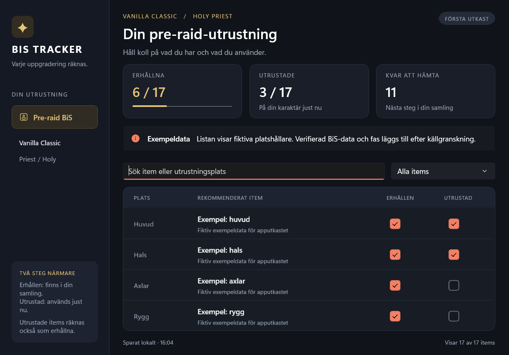

# BISTracker

En app för att visa och tracka best in slot (BiS). Första versionen gäller
Holy Priest i vanliga WoW Classic (Vanilla), fas 1, med pre-raid BiS från
endast dungeons och quests. Appens gränssnitt är på engelska.
Fler expansioner är en framtida riktning.

## Dokumentation

- [Arbetsregler](AGENTS.md)
- [Krav och koppling till kod](docs/requirements.md)
- [Arkitektur och domänspråk](docs/architecture.md)
- [Mappstruktur i projekten](docs/project-structure.md)
- [Plan och öppna frågor](docs/plan.md)
- [Beslut](docs/decisions.md)
- [Arbetsfördelning och kontrakt för utkastet](docs/draft-contract.md)
- [BiS-källresearch](docs/data-research.md)
- [Fas 1-kandidater och anskaffning](docs/phase1-items.md)
- [Itemmetadata, ikonlänkar och importprov](docs/data-import.md)
- [Verifiering och körning](docs/verification.md)

Dokumenten skiljer mellan beslut, förslag och verifierad implementation.

## Nuläge

Första utkastet har en WinUI-vy med sökning, filter och tracking av erhållna
och utrustade items. Domain, Application och Infrastructure är separata projekt
med dokumenterade mappar. Framsteg sparas lokalt i JSON för Holy Priest fas 1.

Appen använder den granskade listans 17 riktiga huvudval, med itembilder,
anskaffning, villkor och klickbara item-/guidelänkar. Of Healing ingår i de
tre suffixmålens namn och identitet. Stormragers villkor beskriver båda
fraktionsvägarna och dungeonalternativet Bonecreeper Stylus.
Katalogen är inbyggd; ikonbilder hämtas vid visning och får en platsmarkering
vid nätverks-/bildfel. Gamla demoframsteg bevaras i en separat fil och överförs
inte till verkligt itemägande. Se [katalogintegrationen](docs/catalog-integration.md).
Se verifieringsdokumentet för kontroller, startkommando och begränsningar.

## Förhandsbild av apputkastet

Bildens markeringar kommer från isolerad verifieringsdata och påverkar inte dina sparade framsteg.
