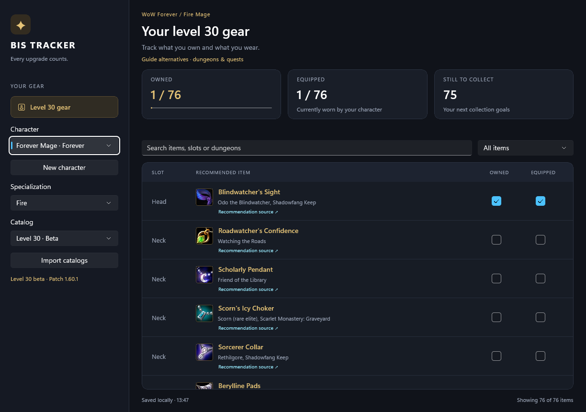

# BISTracker

En app för att visa och tracka best in slot (BiS). Första versionen gäller
Holy Priest i vanliga WoW Classic (Vanilla), fas 1, med pre-raid BiS från
endast dungeons och quests. Appens gränssnitt är på engelska.
WoW Forever är valbar som separat spelversion, med källgranskade beta-kataloger
på nivå 30 för alla nio klasser och 27 specs. Nivå 60 har ett eget katalogset
och kan importeras när granskad data finns.

## Dokumentation

- [Arbetsregler](AGENTS.md)
- [Krav och koppling till kod](docs/requirements.md)
- [Arkitektur och domänspråk](docs/architecture.md)
- [Mappstruktur i projekten](docs/project-structure.md)
- [Plan och öppna frågor](docs/plan.md)
- [Beslut](docs/decisions.md)
- [Arbetsfördelning och kontrakt för utkastet](docs/draft-contract.md)
- [BiS-källresearch](docs/data-research.md)
- [Fas 1-kandidater och anskaffning](docs/phase1-items.md)
- [Itemmetadata, ikonlänkar och importprov](docs/data-import.md)
- [Verifiering och körning](docs/verification.md)
- [Överföring från Boromir och lokal verifiering](docs/local-transfer.md)
- [Forever och tre speclistor per karaktär](docs/forever-feasibility.md)
- [Karaktärer och sparade speclistor](docs/characters-and-loadouts.md)
- [Katalognivåer och säkert byte](docs/catalog-contexts.md)
- [Forever nivå 30: alla 27 kataloger och källgranskning](docs/forever-level30-catalogs.md)

Dokumenten skiljer mellan beslut, förslag och verifierad implementation.

## Nuläge

Första utkastet har en WinUI-vy med sökning, filter och tracking av erhållna
och utrustade items. Domain, Application och Infrastructure är separata projekt
med dokumenterade mappar. Karaktärer och deras tre speclistor sparas lokalt i
versionsstyrd JSON. Ägande delas mellan karaktärens specs; utrustning är separat.
Ny karaktär skapas med namn, spelversion och klass. Byte av karaktär/spec
återställer dess sparade lista. Äldre Holy Priest-framsteg importeras en gång
utan att originalfilen ändras; demoframsteg importeras inte.

Forever-listorna visar guidernas utrustningsalternativ från dungeons och quests,
med item- och källänkar. Alla 27 specs har egna kataloger. Där guiderna eller
källfiltret lämnar luckor har inga egna BiS-val lagts till. Nivå 30 och 60
behåller separata utrustningsuppsättningar; ägandet är gemensamt per karaktär.
**Import catalogs** kopierar validerade JSON-pack och uppdaterar listorna direkt.
Verklig nivå 60-data återstår; [format och regler](docs/catalog-contexts.md).

Classic Holy Priest använder den granskade listans 17 riktiga huvudval, med itembilder,
anskaffning, villkor och klickbara item-/guidelänkar. Of Healing ingår i de
tre suffixmålens namn och identitet. Stormragers villkor beskriver båda
fraktionsvägarna och dungeonalternativet Bonecreeper Stylus.
Katalogen är inbyggd; ikonbilder hämtas vid visning och får en platsmarkering
vid nätverks-/bildfel. Gamla demoframsteg bevaras i en separat fil och överförs
inte till verkligt itemägande. Se [katalogintegrationen](docs/catalog-integration.md).
Se verifieringsdokumentet för kontroller, startkommando och begränsningar.
För specs utan granskad katalog visas en tom lista med uttrycklig datastatus.
Forever använder inte Vanilla-items som ersättning för saknade rekommendationer.

## Förhandsbild av apputkastet

Bildens markeringar kommer från isolerad verifieringsdata och påverkar inte dina sparade framsteg.
